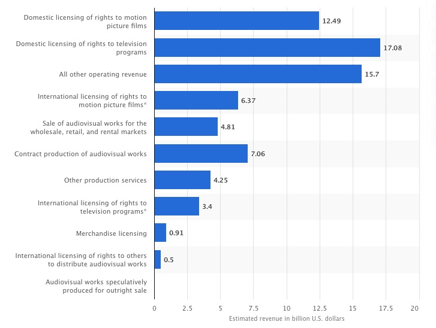

## Context
 
The motion picture and video industry generated [$69.9 billion](https://www.statista.com/statistics/185100/revenue-sources-of-us-motion-picture-and-video-industry-2009/) in revenue 2018. This industry includes several areas such as production companies, film studios, and distributors, among others. There were [452,000](https://datausa.io/profile/naics/motion-pictures-video-industries) people employed in this industry in 2019, including actors, directors, set designers, makeup artists, movie editors, and directors of photography, among others.

**Estimated revenue of the U.S. motion picture, video production and distribution industry in 2019, by source. Source: [Statista](https://www.statista.com/statistics/185100/revenue-sources-of-us-motion-picture-and-video-industry-2009/)**

Streaming services such as [Netflix](https://www.netflix.com), [Hulu], [Disney+] and [HBO Max](https://www.hbomax.com) have become the dominant force in the industry. The largest service, Netflix, had a total net income of over [USD$2.76 billion](https://www.statista.com/statistics/272561/netflix-net-income/) and a revenue of USD$25 billion, in 2020. 

To maintain their preeminence, streaming services allocate significant resources to create new content. This content, in turn, drives customers onto the streaming services increasing subscriptions, improving retention, and creating more user data. This data is then used by streaming services to predict consumer trends, produce new content, and recommend additional shows for customers.

These were the investments made in 2020:

* Netflix ($16 billion)
* Amazon ($7 billion)
* Apple ($6 billion)
* Hulu ($3 billion)
* Disney+ ($1.75 billion)
* HBO ($1.5 billion)

Therefore, to maximize their return on investment, streaming services need to understand customer preferences to improve their competitive edge and increase their revenue.

Sources: [Statista](https://www.statista.com/statistics/185100/revenue-sources-of-us-motion-picture-and-video-industry-2009/), [Data USA](https://datausa.io/profile/naics/motion-pictures-video-industries),[Forbes](https://www.forbes.com/sites/sergeiklebnikov/2020/05/22/streaming-wars-continue-heres-how-much-netflix-amazon-disney-and-their-rivals-are-spending-on-new-content/?sh=3faf0ee3623b).

## Overview

The CEO of Streamflix, a fictional streaming service, has asked his team to prepare a new content strategy for next year. Streamflix is facing intense competition from rival services and it needs to produce appealing content that can increase subscriptions and retain existing customers. 

To fulfill the CEO's request, Streamflix's Data Science Director have tasked you with analyzing the 2020 data from IMDB. He expects to use your findings to inform investment decisions in new content. You will have to report your insights on a Jupyter notebok that will be stored in a Github repository.

## Vocabulary

* **Streaming Service**: a company that delivers media content digitally to various devices over the internet.
* **CEO**: stands for Chief Executive Office, the top person in charge of the organization's day-to-day operations. This person reports to a Board of Directors.
* **Board of Directors**: an elected group of people that represent shareholders in a company. They have oversight over an organization's practices and activities.
* **Data Scientist**: a professional who uses the scientific method, statistics, programming, and algorithms to generate insights from data.

## Learning Goals

At the end of this project, students will be able to:

* 

## Requirements

For full installation instruction and technical requirements click [here](https://github.com/mihir787/turing_data_projects/tree/main/project_3_movie_night).

## Submission

You will submit your findings via a repository on **Github**. The repository will be named `<first name>-<last name>-movie-night`. The repository should contain your Jupyter notebook and SQL file.

## Rubric

The following rubric is divided in technical and professional skills. In order to complete this project successfully, students need to achieve **18 points**.

### Technical Skills

#### Completion

+ 4: The student was able to exceed the technical requirements and deliver additional insights based on the provided data set.
+ 3: The student was able to complete the technical requirements for this project.
+ 2: The student was able to complete the technical requirements except for one or two missing features.
+ 1: The student was not able to complete the technical requirements or does not have a working solution.

#### Organization

+ 4: The student organized his/her notebook, queries, and insights in a clear and logical structure, and included references where needed.
+ 3: The student organized his/her notebook, queries, and insigths in a logical structure.
+ 2: The student organized his/her notebook and queries in a mostly logical structure.
+ 1: The student's project was not clear nor organized.

#### Style

+ 4: The student followed SQL and Python conventions, including proper naming and composition. Student wrote his/her notebook in a clear and concise way.
+ 3: The student followed SQL and Python conventions, including proper naming and composition.
+ 2: The student mostly followed SQL and Python conventions bar some omissions.
+ 1: The student writing was inconsistent and unclear, and his/her code didn't follow conventions.

### Professional Skills

#### Communication

+ 4: The student communicated with his/her instructors in a professional manner. The student proactively provided updates, and responded to instructors' requests in time. The student also communicated any setbacks in time and requested help when necessary.
+ 3: The student communicated with his/her instructors in a professional manner and responded to instructors' requests in time.
+ 2: The student communicated with his/her instructors in a professional manner.
+ 1: The student did not communicated with his/her instructors or did so in a unprofessional way.

#### Time Management

+ 4: The student delivered all the technical requirements and additional insights in time.
+ 3: The student delivered all technical requirements in time.
+ 2: The student delivered most of technical requirements in time.
+ 1: The student did not delivered his technical requirements in time.

#### Problem Solving

+ 4: The student was able to solve his/her own problems by reviewing documentation, obtaining help from peers and mentors, and reaching out to instructors as a last resort.
+ 3: The student was able to solve his/her own problems by obtaining help from peers and mentors, and reaching out to instructors.
+ 2: The student was able to solve his/her own problems by only reaching out to instructors.
+ 1: The student was not able to solve his/her own problems even with additional help.